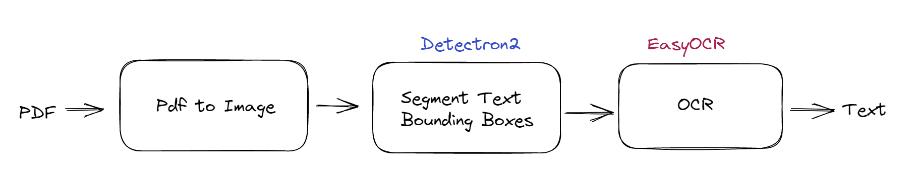
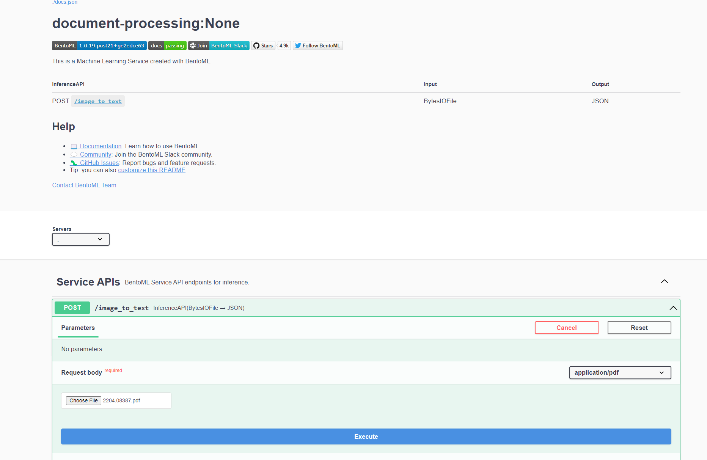

<div align="center">
    <h1 align="center">OCR as a Service</h1>
    <br>
    <strong>Turn any OCR models into online inference API endpoint 🚀<br></strong>
    <i>Powered by BentoML 🍱</i>
    <br>
</div>
<br>

## 📖 Introduction 📖
This project demonstrates how to effortlessly serve an OCR model using BentoML. It accepts PDFs as input and returns the text contained within. The service employs [Microsoft's DiT](https://github.com/microsoft/unilm/tree/master/dit) using [Meta's detectron2](https://github.com/facebookresearch/detectron2) for image segmentation and [EasyOCR](https://github.com/JaidedAI/EasyOCR) for OCR.  



## 🏃‍♂️ Running the Service 🏃‍♂️
### Containers
The most convenient way to run this service is through containers, as the project relies on numerous external dependencies. We provide two pre-built containers optimized for CPU and GPU usage, respectively. 

To run the service, you'll need a container engine such as Docker, Podman, etc. Quickly test the service by running the appropriate container:

```bash
# cpu
docker run -p 3000:3000 ghcr.io/bentoml/ocr-as-a-service:cpu

# gpu
docker run --gpus all -p 3000:3000 ghcr.io/bentoml/ocr-as-a-service:gpu
```

### BentoML CLI

---
#### **Prerequisite 📋**
#### ✅ Python
This project requires Python 3.8 or higher.
#### ✅ Poppler, to convert pdf to image
On MacOS, make sure to install poppler to use `pdf2image`:
```bash
brew install poppler
```

On Linux distros, install `pdftoppm` and `pdftocairo` using your package manager, i.e. with `apt-get`:
```bash
sudo apt install poppler-utils
```

#### ✅ Python Development Package 
To build the Detectron2 wheel, `python3-dev` package is required. On Linux distros, run the following:
```bash
sudo apt install python3-dev
```
> You may need to install a specific version of python3-dev, e.g., `python3.10-dev` for Python 3.10.

For MacOS, Python Development Package is installed by default.

Refer to [Detectron2 installation page](https://detectron2.readthedocs.io/en/latest/tutorials/install.html) for platform specific instructions and further troubleshootings.

---
Once you have all prerequisite installed, clone the repository and install the dependencies:
```bash
git clone https://github.com/bentoml/OCR-as-a-Service.git && cd OCR-as-a-Service

pip install -r requirements/pypi.txt

# This depends on PyTorch, hence needs to be installed afterwards
pip install 'git+https://github.com/facebookresearch/detectron2.git'
```

To serve the model with BentoML:
```
bentoml serve
```

You can then open your browser at http://127.0.0.1:3000 and interact with the service through Swagger UI.

## 🌐 Interacting with the Service 🌐
BentoML's default model serving method is through an HTTP server. In this section, we demonstrate various ways to interact with the service:
### cURL
```bash
curl -X 'POST' \
  'http://localhost:3000/image_to_text' \
  -H 'accept: application/pdf' \
  -H 'Content-Type: multipart/form-data' \
  -F file=@path-to-pdf
```
> Replace `path-to-pdf` with the file path of the PDF you want to send to the service.

### Via BentoClient 🐍
To send requests in Python, one can use ``bentoml.client.Client`` to send requests to the service. Check out `client.py` for the example code.

### Swagger UI
You can use Swagger UI to quickly explore the available endpoints of any BentoML service.



## 🚀 Bringing it to Production 🚀
BentoML offers a number of options for deploying and hosting online ML services into production, learn more at [Deploying Bento Docs](https://docs.bentoml.org/en/latest/concepts/deploy.html).

## 👥 Community 👥
BentoML has a thriving open source community where thousands of ML/AI practitioners are 
contributing to the project, helping other users and discussing the future of AI. 👉 [Pop into our Slack community!](https://l.bentoml.com/join-slack)


